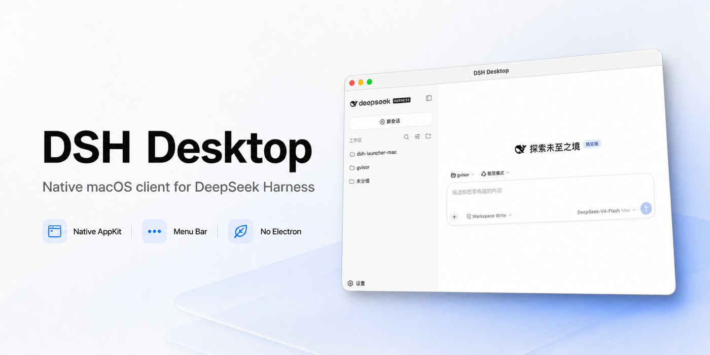

<p align="center">
  
</p>

<p align="center">
  <a href="README.md">English</a> · <strong>简体中文</strong>
</p>

# DSH Desktop for macOS

DSH Desktop 是 [DeepSeek Harness](https://github.com/deepseek-ai/deepseek-harness) 的原生 macOS 菜单栏客户端。它会启动 npm 上最新的 `@deepseek-ai/dsh`，等待仅监听本机回环地址的 Web 服务就绪，再通过 `WKWebView` 显示上游界面。

**无需 Electron，不重复实现 Harness，Apple Silicon 版 DMG 仅约 550 KB。**

[下载最新版本](https://github.com/Demogorgon314/dsh-desktop-mac/releases/latest)

## 功能特性

- 基于 AppKit 的原生 macOS 窗口和菜单栏图标
- 应用运行时在 Dock 中显示图标
- 菜单栏和应用使用 DeepSeek 官方小鲸鱼图标
- 左键显示或隐藏窗口，右键查看状态和执行操作
- 支持启动、停止、重启、更新、打开日志、打开数据目录和退出
- 通过 `npm exec` 启动最新 DSH，并在联网失败时回退到 npm 离线缓存
- 只记录最后一次成功运行的版本，不维护独立的 DSH 安装目录
- 使用随机 `127.0.0.1` 端口，并进行服务就绪检测
- 优雅关闭子进程，超时后强制终止
- 同源页面在 `WKWebView` 中打开，外部链接交给默认浏览器
- 支持标准复制、粘贴等 macOS 快捷键和文件下载

## 安装

系统要求：

- macOS 13 或更高版本
- Node.js 22.19.x 或 Node.js 24 及以上版本，包含 npm

从 [GitHub Releases](https://github.com/Demogorgon314/dsh-desktop-mac/releases/latest) 下载与你的 Mac 对应的 DMG，打开后将 `DSH Desktop.app` 拖入 `Applications`。

当前发布版本使用 ad-hoc 签名，尚未经过 Apple 公证。如果 macOS 提示应用无法验证或禁止启动，请执行：

```sh
sudo xattr -dr com.apple.quarantine "/Applications/DSH Desktop.app"
open "/Applications/DSH Desktop.app"
```

仅对从本仓库官方 Release 下载的应用执行该命令。

## DSH 启动与离线缓存

DSH Desktop 每次启动都会通过 `npm exec` 准备当前版本的 `@deepseek-ai/dsh` 和 `pnpm`。第一次在线启动成功后，如果后续联网启动失败，应用会从 npm 缓存启动最后一次成功运行的精确版本。

因此第一次启动必须能够访问 npm registry。DSH 和 `pnpm` 使用 npm 的常规缓存：

```text
~/.npm
```

DSH Desktop 不会在 `~/Library/Application Support/DSH Desktop` 中保存一份独立的 DSH 运行时，所以应用自身能够保持很小。

## 插件和用户数据兼容性

Harness 状态与命令行 `dsh` 使用相同的默认 `DSH_HOME`：

```text
~/.dsh
```

如果环境变量中显式设置了 `DSH_HOME`，DSH Desktop 会继承该设置。配置文件、已安装插件、API 凭据、设置、预设、附件和会话都可以与命令行直接启动的 `dsh` 共享，并且不会因 DSH Desktop 或 DSH 升级而丢失。

DSH Desktop 会让 `npm exec` 同时把兼容上游的 `pnpm` 暴露到 `PATH`，因此 `dsh plugin --profile <name> ...` 仍可在 `$DSH_HOME/profiles/<name>` 中正常管理插件。

请勿让命令行启动的 `dsh` 服务和 DSH Desktop 服务同时使用同一个 `DSH_HOME`。

## 本地开发

开发环境要求：

- macOS 13 或更高版本
- Xcode 15 或更高版本
- Node.js 22.19.x 或 Node.js 24 及以上版本，包含 npm

运行测试和应用：

```sh
swift test
swift run DSHDesktop
```

## 构建应用

构建 `.app`：

```sh
./scripts/package-app.sh
open "build/DSH Desktop.app"
```

构建并验证可拖拽安装的 DMG：

```sh
./scripts/package-dmg.sh
open "build/DSH Desktop.dmg"
```

如需制作包含 Node.js 的自包含版本，可提供带有 `bin/node`、`bin/npm` 及 npm 支持文件的 macOS Node.js 运行时目录：

```sh
DSH_NODE_RUNTIME=/path/to/node-runtime ./scripts/package-app.sh
```

开发构建使用 ad-hoc 签名。正式分发时应设置 `CODE_SIGN_IDENTITY`、在发布流程中启用 Hardened Runtime，并完成 Apple 公证。

## 发布

推送语义化版本 tag 后，GitHub Actions 会运行测试，分别构建 Apple Silicon 和 Intel 版本，并发布带 SHA-256 校验文件的 DMG：

```sh
git tag v0.1.0
git push origin v0.1.0
```

品牌素材归属说明请参阅 [THIRD_PARTY_NOTICES.md](THIRD_PARTY_NOTICES.md)。
